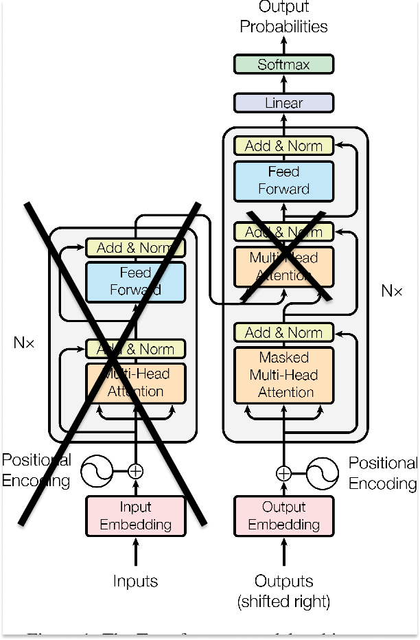

# shakespeare-GPT

## Introduction
Welcome to this repository, an extension of the engaging lecture by Andrej Karpathy. This project dives deep into the transformer architecture, as explained in the groundbreaking paper "Attention Is All You Need". Together, we will implement the topics into real code and construct our version of a GPT that might produce nonsensical output but in a style reminiscent of Shakespeare's works.

## Starting Point
Our journey starts with Andrej providing a starting point for building a GPT from scratch. We use a compact dataset, which is an amalgamation of all of Shakespeare's works, and a similarly modest number of parameters (approximately 370K were used in training).

The starting point is illustrated below:

**Note**: This transformer is purely a decoding transformer, as depicted by the large 'X' cancelling out the encoding section. It relies on self-attention rather than cross-attention, rendering the second attention layer redundant (indicated by the small 'X').

## My Continuation of Work
The subsequent work conducted in the `improved-gpt.py` file continues Andrej's original endeavors. This progression wouldn't have been achievable without a solid understanding of the topics discussed in the initial models. My understanding can additionally be
demonstrated by the extensive comments detailing key concpets and flow of information/data.

### I added
* A scheduler to scale learning rate based on position relative to the local minima approached to in gradient descent
** This decreased loss rates by a mean factor of "___" after 100 trials holding all other hyperparamters equal

## Skills and Lessons Acquired
Through this project, you will gain skills and learn about various aspects including:
* Tokenization
* Constructing a transformer from scratch
* PyTorch
* Model training using AdamW
* Model validation
* Self-attention
* Autoregressive language modeling